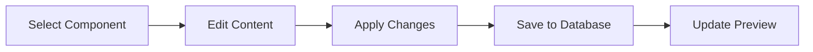

# 🚀 AI-Powered Site Editor SaaS

Transform any static website into a dynamic, editable experience with AI-powered suggestions and visual editing tools.


## ✨ Features

### 🎨 Visual Editor

- **Drag & Drop Interface**: Intuitive component-based editor
- **Live Editing**: Real-time content updates with inline editing
- **Component Library**: Pre-built components (Hero, Navbar, CTA, etc.)
- **Responsive Design**: Mobile-first editing experience

### 🤖 AI Integration

- **Smart Site Parsing**: Automatically extract components from any website
- **UX Suggestions**: AI-powered layout and design recommendations
- **Content Optimization**: Intelligent content structure analysis
- **Layout Intelligence**: Automated component positioning suggestions

### 💳 Subscription System

- **Flexible Pricing**: Daily ($9) and Monthly ($29) plans
- **Stripe Integration**: Secure payment processing
- **Usage Analytics**: Track editor usage and project metrics
- **Subscription Management**: Easy plan upgrades and cancellations

### 🔐 Enterprise Features

- **Secure Authentication**: Email/password with JWT tokens
- **Row-Level Security**: Database-level access control
- **Project Management**: Unlimited projects per subscription
- **Data Export**: Export projects and components

## 🏗️ Tech Stack

### Frontend

- **React 19** with TypeScript
- **Vite** for fast development and building
- **Tailwind CSS** for styling
- **Framer Motion** for animations
- **React Query** for state management
- **React DnD** for drag-and-drop functionality

### Backend

- **Supabase** for database, auth, and edge functions
- **PostgreSQL** with Row Level Security
- **Edge Functions** for serverless API endpoints
- **Real-time subscriptions** for live updates

### AI & Services

- **OpenAI GPT-4** for UX suggestions and content analysis
- **Stripe** for subscription management
- **Vercel** for frontend deployment

## 🚀 Quick Start

### Prerequisites

- Node.js 18+
- Supabase account
- Stripe account
- OpenAI API key

### Installation

1. **Clone the repository**

   ```bash
   git clone https://github.com/your-username/ai-site-editor.git
   cd ai-site-editor
   ```

2. **Install dependencies**

   ```bash
   npm install
   ```

3. **Set up environment variables**

   ```bash
   cp .env.example .env
   # Edit .env with your credentials
   ```

4. **Start Supabase locally**

   ```bash
   npx supabase start
   ```

5. **Run database migrations**

   ```bash
   # Copy content from database/schema.sql to Supabase SQL Editor
   ```

6. **Start the development server**
   ```bash
   npm run dev
   ```

Visit `http://localhost:3000` to see the app in action!

## 📊 Project Structure

```
ai-site-editor/
├── src/
│   ├── components/
│   │   ├── editor/           # Visual editor components
│   │   ├── AuthGuard.tsx     # Route protection
│   │   └── SubscriptionGuard.tsx
│   ├── pages/
│   │   ├── Dashboard.tsx     # Project management
│   │   ├── Editor.tsx        # Visual editor
│   │   ├── Pricing.tsx       # Subscription plans
│   │   └── Home.tsx          # Landing page
│   ├── lib/
│   │   ├── api.ts           # API service layer
│   │   └── supabase.ts      # Supabase client
│   └── types/
│       └── database.ts      # TypeScript types
├── supabase/
│   ├── functions/           # Edge functions
│   └── config.toml         # Supabase configuration
├── database/
│   └── schema.sql          # Database schema
└── DEPLOYMENT.md           # Deployment guide
```

## 🎯 Core Workflows

### 1. Project Creation


### 2. Visual Editing



### 3. AI Suggestions


## 🔌 API Reference

### Projects

```typescript
// Get user projects
GET /api/projects
Response: { data: Project[], count: number }

// Create project from URL
POST /api/projects
Body: { site_url: string }
Response: { data: Project }

// Update project
PUT /api/projects/:id
Body: Partial<Project>
Response: { data: Project }
```

### Components

```typescript
// Get project components
GET /api/components?project_id=:id
Response: { data: Component[] }

// Update component
PUT /api/components/:id
Body: { content?: object, styles?: object }
Response: { data: Component }
```

### AI Suggestions

```typescript
// Generate UX suggestions
POST /api/ai/suggestions
Body: { projectId: string, components: Component[] }
Response: { data: AISuggestion[] }
```

## 🎨 Component Types

### Hero Section

```typescript
interface HeroContent {
  title: string;
  subtitle?: string;
  backgroundImage?: string;
  backgroundColor?: string;
  ctaText?: string;
  ctaUrl?: string;
}
```

### Navigation Bar

```typescript
interface NavbarContent {
  logoText?: string;
  links: Array<{ text: string; url: string }>;
  backgroundColor?: string;
  textColor?: string;
}
```

### Call to Action

```typescript
interface CTAContent {
  text: string;
  url: string;
  backgroundColor?: string;
  textColor?: string;
  size?: "small" | "medium" | "large";
}
```

## 🔒 Security

- **Authentication**: JWT-based with Supabase Auth
- **Authorization**: Row Level Security (RLS) policies
- **Data Protection**: Encrypted connections and secure API endpoints
- **Payment Security**: PCI-compliant Stripe integration
- **Environment Variables**: Secure credential management

## 📈 Subscription Plans

| Feature        | Daily ($9) | Monthly ($29) |
| -------------- | ---------- | ------------- |
| Editor Access  | 24 hours   | 30 days       |
| Projects       | Unlimited  | Unlimited     |
| AI Suggestions | ✅         | ✅ Advanced   |
| Export         | ✅         | ✅ Priority   |
| Support        | Email      | 24/7 Premium  |
| Custom Domains | ❌         | ✅            |
| Analytics      | ❌         | ✅            |

## 🧪 Testing

```bash
# Run unit tests
npm test

# Run integration tests
npm run test:integration

# Run E2E tests
npm run test:e2e

# Check TypeScript
npm run type-check

# Lint code
npm run lint
```

## 🚀 Deployment

See [DEPLOYMENT.md](./DEPLOYMENT.md) for comprehensive deployment instructions.

### Quick Deploy to Vercel

[](https://vercel.com/new/clone?repository-url=https://github.com/your-username/ai-site-editor)

## 🤝 Contributing

We welcome contributions! Please see our [Contributing Guide](CONTRIBUTING.md) for details.

1. Fork the repository
2. Create your feature branch (`git checkout -b feature/amazing-feature`)
3. Commit your changes (`git commit -m 'Add amazing feature'`)
4. Push to the branch (`git push origin feature/amazing-feature`)
5. Open a Pull Request

## 📝 License

This project is licensed under the MIT License - see the [LICENSE](LICENSE) file for details.

## 🙏 Acknowledgments

- [Supabase](https://supabase.com) for the excellent backend-as-a-service
- [OpenAI](https://openai.com) for powerful AI capabilities
- [Stripe](https://stripe.com) for seamless payment processing
- [Vercel](https://vercel.com) for amazing deployment experience
- [Tailwind CSS](https://tailwindcss.com) for beautiful styling
- [Framer Motion](https://framer.com/motion) for smooth animations

## 📞 Support

- 📧 Email: support@sitestudio.online
- 💬 Discord: [Join our community](https://discord.gg/your-invite)
- 📖 Documentation: [docs.sitestudio.online](https://docs.sitestudio.online)
- 🐛 Issues: [GitHub Issues](https://github.com/your-username/ai-site-editor/issues)

---

<div align="center">

**[Website](https://sitestudio.online)** • **[Documentation](https://docs.sitestudio.online)** • **[Demo](https://demo.sitestudio.online)**

Made with ❤️ by [David Musungu](https://github.com/bignimz)

</div>
